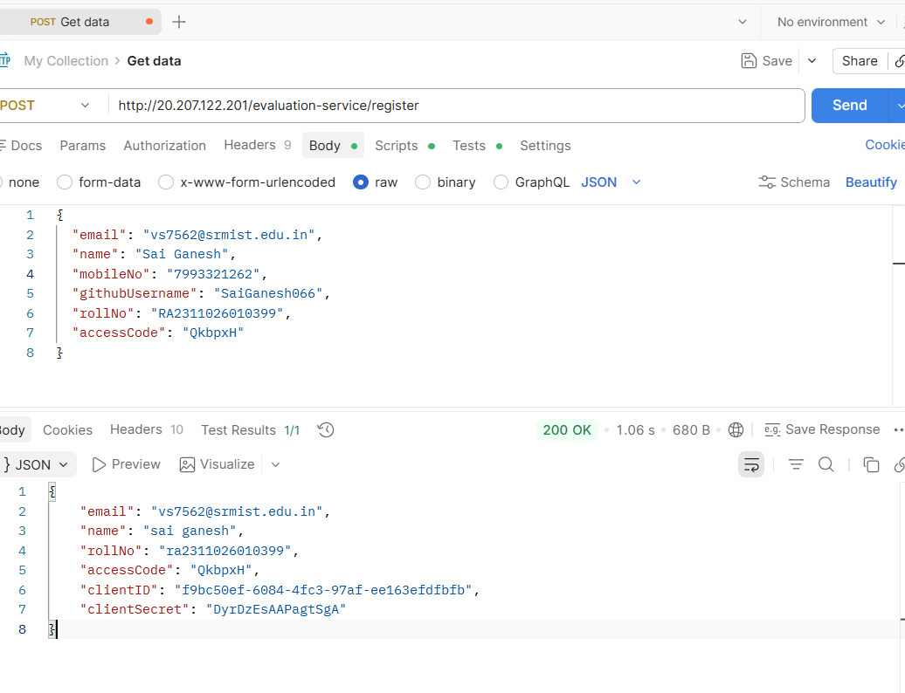
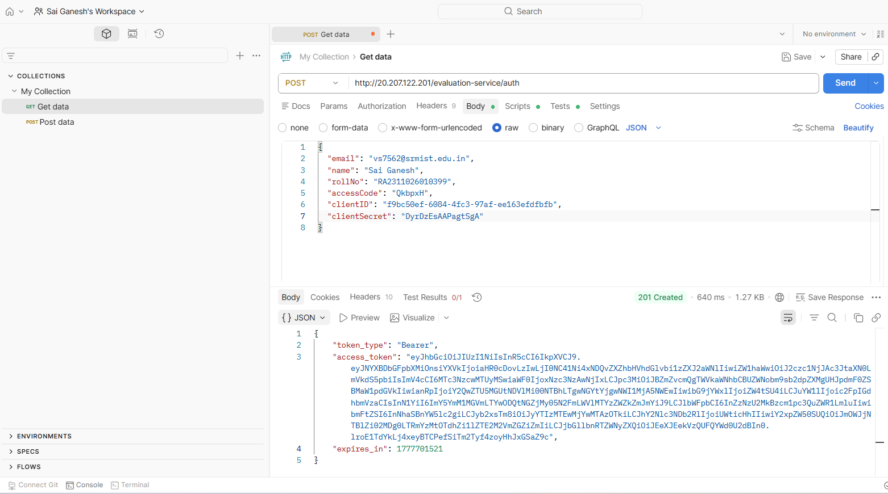
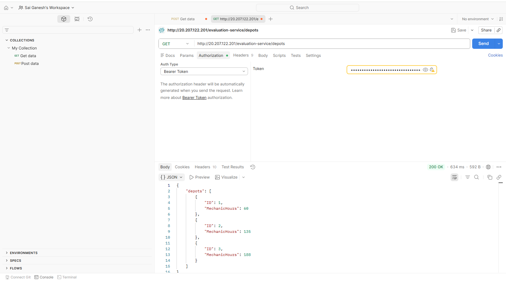
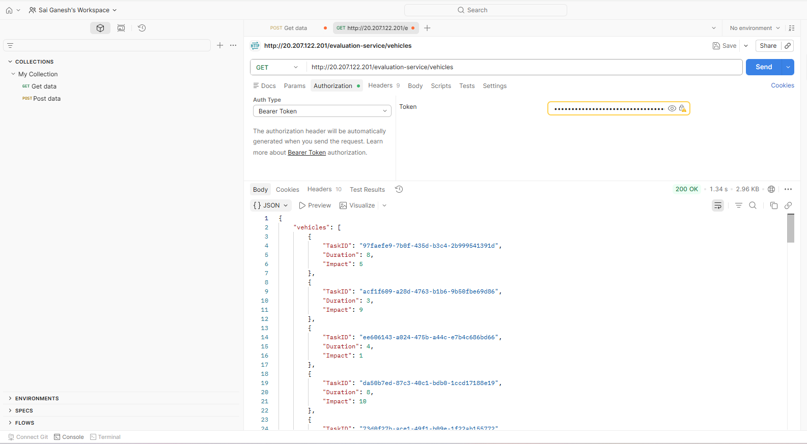
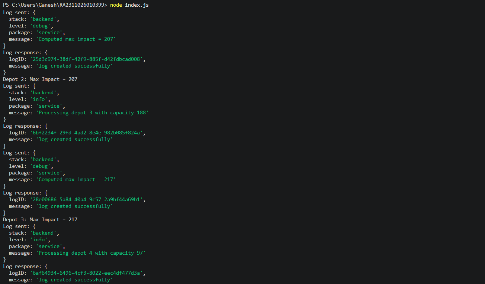
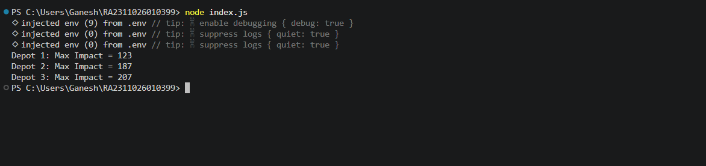

Notification System Design

Stage 1: API Design

1. Get Notifications
   GET /notifications?studentId=1042

Response:

```
{
  "notifications": [
    {
      "id": 1,
      "type": "Placement",
      "message": "Company XYZ shortlisted you",
      "isRead": false,
      "createdAt": "2026-05-02T10:00:00Z"
    }
  ]
}
```

2. Create Notification
   POST /notifications

Request Body:

```
{
  "studentId": 1042,
  "type": "Event",
  "message": "Workshop on AI tomorrow"
}
```

3. Mark as Read
   PATCH /notifications/:id/read

Real-time Delivery
To support real-time updates, WebSockets or Server-Sent Events (SSE) can be used to push notifications instantly without polling.

---

Stage 2: Database Design

Using PostgreSQL

```
CREATE TABLE notifications (
  id SERIAL PRIMARY KEY,
  studentId INT,
  type VARCHAR(50),
  message TEXT,
  isRead BOOLEAN DEFAULT FALSE,
  createdAt TIMESTAMP DEFAULT CURRENT_TIMESTAMP
);
```

Problems
Large number of notifications can lead to slow queries.
Frequent reads can increase database load.

Solutions
Add indexing to improve query performance.
Use partitioning based on studentId.
Archive old notifications to reduce table size.

---

Stage 3: Query Optimization

Slow Query

```
SELECT * FROM notifications
WHERE studentId = 1042 AND isRead = false
ORDER BY createdAt DESC;
```

Optimized Query

```
CREATE INDEX idx_notifications
ON notifications(studentId, isRead, createdAt DESC);
```

Improvement
Reduces full table scan.
Improves query speed.
Enhances performance under high load.

---

Stage 4: Scaling Strategy

Problem
High traffic results in excessive database reads.

Solutions
Use caching such as Redis to store recent notifications and reduce database hits.
Implement pagination using queries like GET /notifications?page=1&limit=10.
Use lazy loading to fetch additional data only when required.

---

Stage 5: Notification Delivery Failure

Problem
Sending emails directly can cause failures and delays.

Solution
Use a message queue such as Kafka or RabbitMQ.

Flow
Producer sends message to queue.
Queue stores the message.
Worker processes the message.
Email service sends notification.

Benefits
Supports asynchronous processing.
Provides retry mechanisms.
Improves reliability.

---

Stage 6: Priority Notification System

Requirement
Display top 10 notifications based on priority.

Priority Logic
Placement has highest priority.
Event has medium priority.
Result has lowest priority.

Implementation

```
function getTopNotifications(data) {
  const priorityMap = {
    Placement: 3,
    Event: 2,
    Result: 1
  };

  return data
    .sort((a, b) => {
      if (priorityMap[b.type] !== priorityMap[a.type]) {
        return priorityMap[b.type] - priorityMap[a.type];
      }
      return new Date(b.createdAt) - new Date(a.createdAt);
    })
    .slice(0, 10);
}
```

Output
Returns top 10 notifications sorted by priority and recency.

---

Conclusion

The system supports real-time notifications, efficient scaling using caching and queues, optimized queries through indexing, and prioritization of important notifications.
Screenshots

Register API  


Auth API  


Depots API  


Vehicles API  


Logging Middleware  


Terminal Output  
